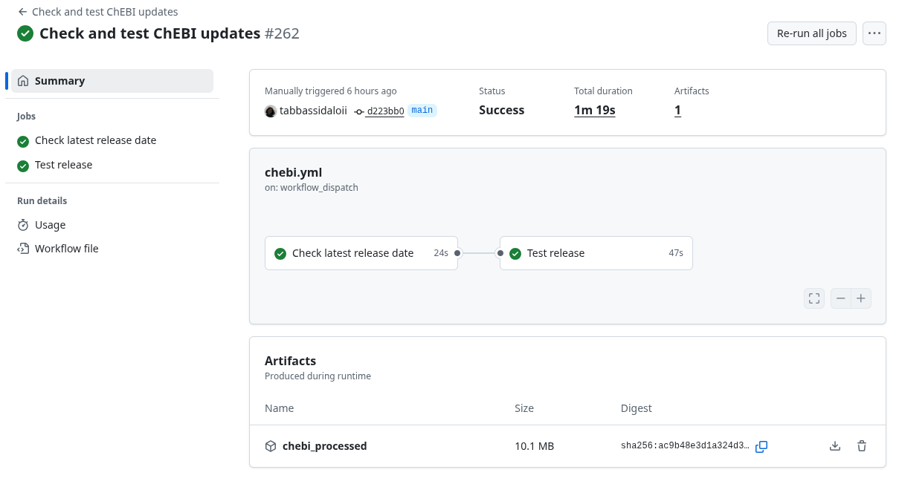

# Introduction

Databases use identifiers to point to records. One of the goals of BridgeDb is
is to map identifier for a record from one database to the identifier of a 
matching record in another database. This is explained in the Tutorial vigenette.

However, within one databases, linking from one identifier to another can also
be useful. Many databases have older and newer identifiers, where the newer
identfier replaces the older identifier. For example, [HGNC](https://www.genenames.org/)
replaces symbols to make naming more consistent or to solve ambiguity.

The recent [sec2pri](https://github.com/sec2pri) and BridgeDb [Tiwid](https://github.com/bridgedb/tiwid)
projects track outdated identifiers. These projects define secondary identifiers
as identifiers that should not be used anymore. Some of them have been replaced
by new identifiers, called primary identifiers.

This vignette explains how to use `sec2pri` BridgeDb identifier mapping files
to detect secondary identifiers, and, where possible, suggest the replacing
primary identifier.

The [Bioconductor BridgeDbR package](https://doi.org/10.18129/B9.bioc.BridgeDbR)
page describes how to install the package. After installation, the library can be loaded with the following command:

```{r, eval=FALSE}
install.packages("BiocManager")
BiocManager::install("BridgeDbR")
install.packages(pkgs=c("rJava", "curl"))

library(curl)
library(rJava)
library(BridgeDbR)
```

*Note: if you have trouble with rJava (required package), please read the [general information](https://www.rforge.net/rJava/docs/index.html) or
follow the instructions [here](https://github.com/hannarud/r-best-practices/wiki/Installing-RJava-(Ubuntu)) for Ubuntu.

## Downloading sec2pri databases

The first thing to do is download a BridgeDb identifier mapping database. This
database is a `.bridge` file just as those from the BridgeDb website. The difference
is that these `sec2pri` databases focus on primary and secondary identifiers of
a single data source.

Here we will use ChEBI [@Hastings2016] as an example. These files can be downloaded
as artifacts produced during one of the GitHub Actions in the `mapping_preprocessing`
repository, specifically, [here](https://github.com/sec2pri/mapping_preprocessing/actions/workflows/chebi.yml).

Click the most recently run `Check and test ChEBI updates` run, and notice the
artifacts:



Click the `chebi_procesed` artifact and save this locally as a `chebi_processed.zip`
file. Unzip the file to get the `ChEBI_secID2priID.bridge` file in the current working directory.

## Loading the sec2pri database

This downloaded file is then loaded with (see also the Tutorial vignette):

```{r, eval=FALSE}
sec2pri = BridgeDbR::loadDatabase("ChEBI_secID2priID.bridge")
```

## Analyzing ChEBI identifiers

Let's say we have the ChEBI identifier `CHEBI:1234` in our dataset and we want to
know if this is a primary or a secondary identifier. We can check with the `sec2pri`
databases which other identifiers it is mapped to:

```{r, eval=FALSE}
BridgeDbR::map(sec2pri, source="Ce", identifier="CHEBI:1234")
```

The output looks like this:

```
  source identifier target     mapping isPrimary
1     Ce CHEBI:1234     Ce  CHEBI:1234         F
2     Ce CHEBI:1234     Ce CHEBI:19730         F
3     Ce CHEBI:1234     Ce CHEBI:28423         T
```

Two first two columns are your input identifier, and column three and four are
mapped identifiers. The fifth column indicates if the column is primary (`T`) or
secondary (`F`). We see here that `CHEBI:1234` is a secondary identifier.

We also see that there is a matching primary identifier, `CHEBI:28243`.

We can extract the primary identifier with regular R code, e.g. like:

```{r, eval=FALSE}
mappedIDs = BridgeDbR::map(sec2pri, source="Ce", identifier="CHEBI:1234")
mappedIDs[intersect(which(mappedIDs[,"target"] == "Ce"),which(mappedIDs[,"isPrimary"] == "T")),]
```

## Conclusion

With the appropriate `sec2pri` you can use this approach to identify secondary
identifiers, and where possible, replace them with the matching primary identifier.

Please keep in mind, most databases have their own reasons for when to replace
an identifier, and rules how to do that. Some databases do not, however, have
1-to-1 relationships, and manual inspection is recommended.

# References {.unnumbered}

# Session info

Here is the output of `sessionInfo()` on the system on which this document was
compiled running pandoc `r rmarkdown::pandoc_version()`:

```{r sessionInfo, echo=FALSE}
sessionInfo()
```
